# Utiliser GIT

***

Lorsque vous travaillez sur un projet de code, vous allez régulièrement y apporter des modifications, et par moments ces modifications vont provoquer des bugs. Lorsque vous revenez sur votre projet après quelques jours ou même quelques heures, il peut être difficile de vous souvenir des dernières modifications que vous avez effectuées et de retrouver vos repères dans votre code. 

Avec un logiciel de versioning comme Git, vous pouvez garder la trace de toutes les modifications faites sur votre code pour pouvoir vous y retrouver à tout moment. À chaque fois que vous faites une série de modifications (créer un fichier, supprimer un fichier, modifier un texte dans un fichier, etc.),  vous allez pouvoir enregistrer ces modifs dans un **commit**.

Par exemple, si vous travaillez sur un formulaire de newsletter en ligne :

- Vous allez d'abord faire une 1re série de modifications pour créer la base HTML/CSS de votre formulaire. 
  => Une fois ces modifications faites, vous pourrez faire un premier commit dans Git et le nommer *"1re passe sur le formulaire de newsletter"*.
- Ensuite, vous rendrez peut-être votre formulaire dynamique avec du PHP. 
  => 2e commit : *"PHP ajouté".*
- Enfin, un collègue vous demandera de changer le wording sur le champs du formulaire. 
  => 3e commit : *"Texte reformulé".*

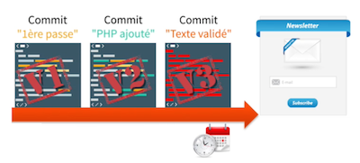

Un **commit** correspond donc à une **version** de votre code à un instant T.

La somme de tous ces commits constitue l'historique de votre projet. L'intérêt de **GIT** est que vous pouvez vous placer à n'importe quel endroit de cet historique. En cas de bug par exemple,où lorsque plusieurs personnes travaillent sur un même projet, revenir en arrière sur un commit précis s'avère très utile.

***

Il existe de nombreux logiciels de gestion de version, qui peuvent être basés sur différents modèles :

- **Modèle** **centralisé** : un serveur central contrôle toute la base de code du logiciel. 
  *Exemples de logiciels de versioning utilisant un modèle centralisé :* SVN, CVS.
- **Modèle** **distribué** : toutes les machines ont accès à la base de code, pas besoin de passer par un serveur central. 
  *Exemples de logiciels de versioning utilisant un modèle distribué :* Git, Mercurial, Bazaar.

Le modèle distribué présente plusieurs avantages : 

- Moins de risques de perdre son code puisqu'il est accessible par plusieurs sources.
- On peut travailler plus rapidement et sans être connecté à Internet puisqu'il n'y a pas besoin de se connecter à un serveur central.

En plus des avantages du modèle distribué, Git a un autre atout : une grande communauté ! Cela facilite la collaboration et les échanges fructueux entre développeurs.

***

## Installer GIT

Maintenant que vous avez compris le principe du versioning, il est temps de vous équiper pour découvrir en pratique les avantages de Git.

### Installation sur système Linux

Téléchargez la dernière version de Git sur <a href="https://git-scm.com/download/linux">Git scm</a>

```shell
sudo apt update && sudo apt upgrade
sudo apt-get install git
git --version 
# git version 2.17.1
```

Une fois installé, pour définir votre nom de compte et votre email tappez cette commande :

```sh
git config --global user.name "Votre nom ou pseudo"
git config --global user.email "Votre@email.com"
```

Créez ensuite un nouveau dossier et positionnez vous dedans :

```sh
# Repository = répertoire de travail géré par GIT
mkdir first_repository
cd first_repository
```

Pour initialiser ce dossier comme repository :

```sh
git init
```

Vous pouvez maintenant créer un fichier, par exemple :

```sh
touch nom_de_fichier.extension
```

Pour ajouter ce fichier à l'index Git fraichement crée :

```sh
git add nom_de_fichier.extension
# ou pour ajouter tout les fichiers/dossiers
git add .
```

Lorsque vous modifiez votre repository, vous devez demander à Git d'enregistrer vos modificatioons en faisant cette commande :

```sh
git commit -m 'Ajout add nom_de_fichier.extension'
```

Pour afficher la liste de tous les commits que vous avez réalisés :

```sh
git log
# sens de lecture => plus récent commit en haut, plus vieux commit en bas 
```

Si vous ne faites que mettre à jour un fichier que vous aviez déjà ajouté à l'index, vous pouvez condenser ces deux étapes de la façon suivante : 

```sh
git commit -a -m 'Ajout add nom_de_fichier.extension'
# l'option -a demande à Git de mettre à jour les fichiers déjà existants dans son index
```

***

### Se positionner sur un commit donné

Lorsque vous effectuez une série de commits sur un projet, il peut vous arriver de vouloir remonter dans le temps à la recherche d'erreurs éventuelles par exemple. Pour vous positionner sur un commit donné de votre historique, il vous suffit d'utiliser la commande **git checkout** de la façon suivante : 

```sh
git checkout SHADuCommit
# ex : git checkout 1a65e3255c013f2c6e0c8045ba9bd790f512ce76
```

Pour revenir à votre branche principale (au commit le plus récent) :

```sh
git checkout master
```

Si vous voulez simplement modifier le message de votre dernier commit, vous pouvez utiliser la commande suivante :

```sh
git commit --amend -m "Votre nouveau message"
# vous ne pourrez utiliser cette commande que si vous n'avez pas encore push votre commit sur l'origine
```

***

### Récupérez du code d'un autre repository

A partir de Gitea / GitHub / Gitlab etc... vous pouvez clôner un repository sur votre machine. Pour cela il suffit d'aller chercher le repository qui vous intéresse sur l'une de ces platformes puis d'utiliser la fonctionnalité 

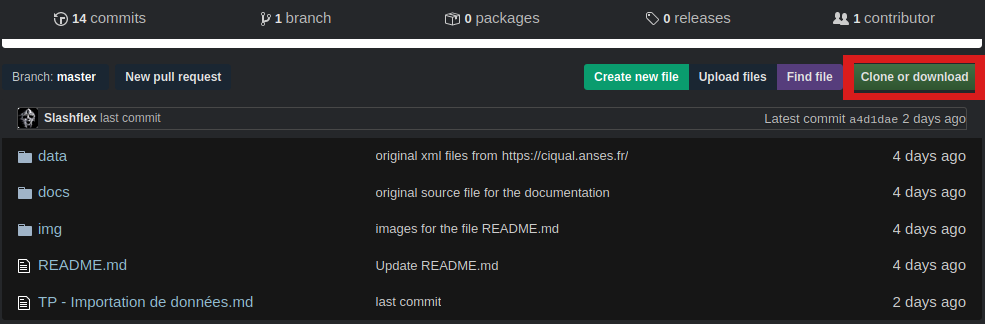

puis cliquez sur le bouton ```HTTP```, et copiez l'URL ex : 

```
https://github.com/reactjs/reactjs.org.git
```

ensuite vous pouvez utiliser cette commande afin de cloner ce repo sur votre machine :

```sh
git clone https://github.com/reactjs/reactjs.org.git
```

Nous venons de cloner le repo de la librairie React.js, une librairie créée par Facebook et qui permet de mieux gérer ses interfaces graphiques grâce à JavaScript.

***

### Générer une clé SSH publique

Positionnez vous dans le dossier caché ```.ssh``` :

```sh
cd ~/.ssh
```

Pour générer une clé **SSH** entrez cette commande :

```sh
ssh-keygen -t rsa -b 4096 -C "your_email@example.com"
# génère une nouvelle clé SSH en utilisant l'email indiqué
```

La commande vous demande alors le nom du fichier dans lequel sauvegarder cette clé, appuyez sur  ```Enter``` :

```sh
> Enter a file in which to save the key (/home/you/.ssh/id_rsa): [Press enter]
> Enter passphrase (empty for no passphrase): [Press enter]
> Enter same passphrase again: [Press enter]
```

Ajoutez la clé SSH à l'agent SSH :

```sh
ssh-add ~/.ssh/id_rsa
```

Copiez la clé :

```sh
cat .ssh/id_rsa.pub # .pub pour publique
```

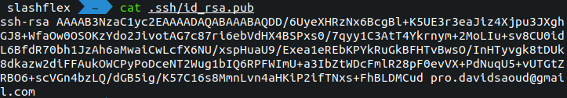

Nous pouvons maintenant ajouter cette clé copiée dans Gitea en collant notre clé dans le champ par exemple :

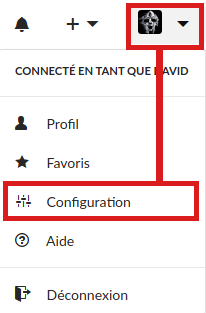

***

### Créons notre premier repository (dépôt en Français)

Une fois connecté à l'une de platforme de versionning, cliquez sur le bouton ```+``` en haut à droite de l'écran puis cliquez sur **Nouveau dépôt**:

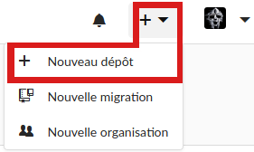

La platforme de versionning vous demandera alors d'indiquer quelquels détails concernant votre repository :

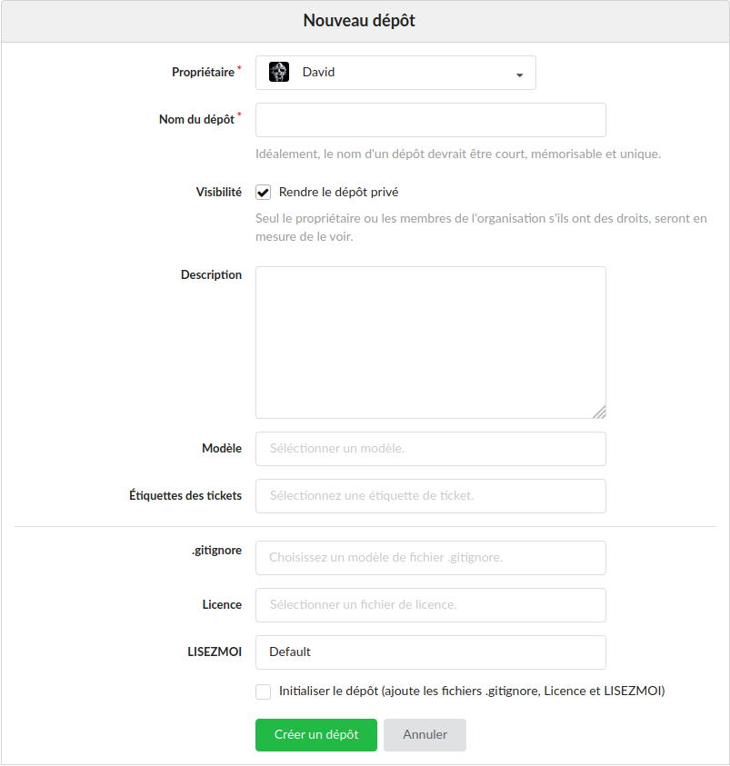

Veillez à cliquer sur la case **SSH** à gauche de l'url afin de ne pas avoir a indiquer votre nom d'utilisateur et mot de passe a chaque push sur votre repo (vous devez au préalable avoir ajouté une clé ```SSH```)

Une fois le repository crée, une autre page s'affiche avec une liste de commandes à effectuer

 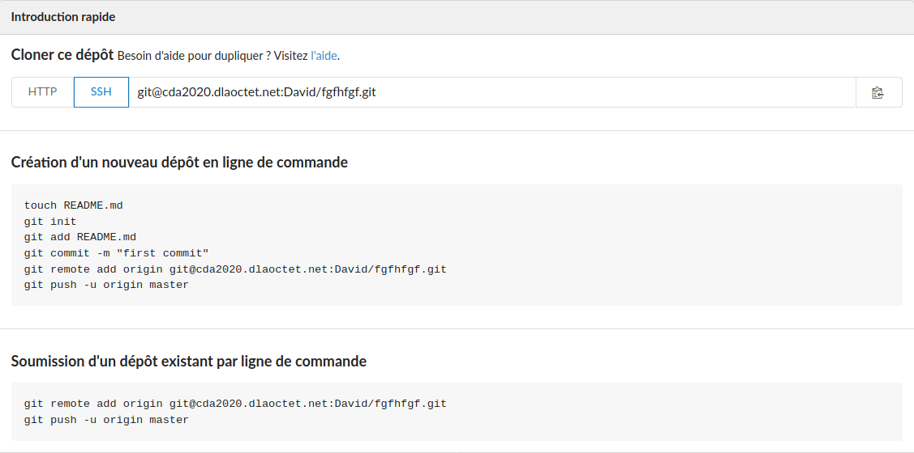

Créez alors un nouveau Dossier sur votre machine qui contiendra votre projet, par Ex :

```sh
mkdir Applications/test
cd Applications/test

# puis initialiser ce dossier en repository git
touch README.md
git init
git add README.md
git commit -m 'message du commit'
git remote add origin git@cda2020.dlaoctet.net:David/test.git # test => nom du repo que vous avez donnez sur gitea lors de la création de celui-ci
git push -u origin master
```

Vous pouvez maintenant rafraîchir la page **Gitea** et tomber sur cette page : 

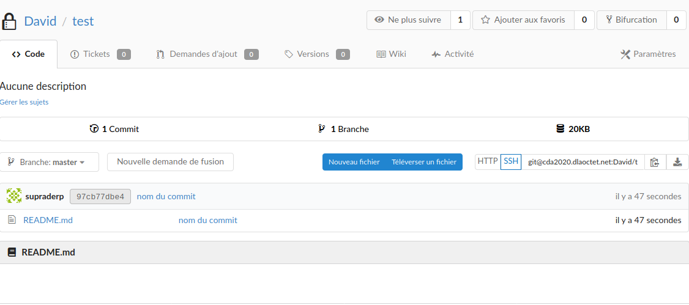

Il n'y a pour le moment dans notre dossier ```test``` que le fichier **README.md** et le dossier caché d'initialization à ```GIT``` (.git)

Nous pouvons maintenant par exemple modifier notre fichier **README.md** (qui doit se nommer ainsi et qui s'affiche par défaut lorsque l'on se rend sur le repository d'une personne) dans un IDE (Visual Studio par exemple) ou **Vim** :

```sh
# Projet test pour apprendre l'utilisation de git et gitea
```

Nous venons de modifier notre fichier **README.md** en ajoutant un peu texte

Nous pouvons regarder le status de **GIT** avec la commande : 

```sh
git status
```

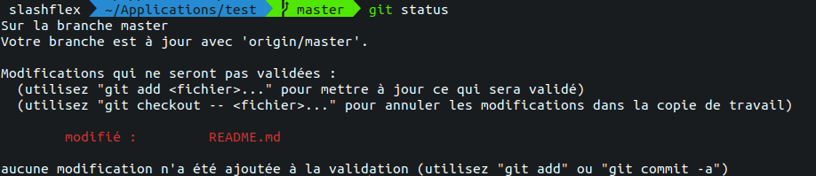

Git nous renvoit bien le nom de notre fichier modifié :

```sh
# nous ajoutons le fichier modifié
git add README.md

# nous nommons notre commit
git commit -m 'Modification README.md'

# nous pouvons finalement push ce changement sur le repository de gitea
git push
```

Après avoir effectué ces 3 commandes vous devriez obtenir ces messages :

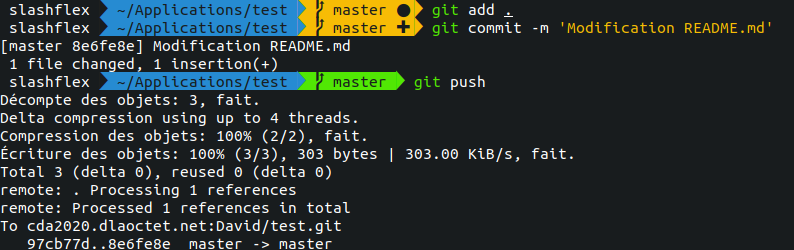

Vous pouvez voir sur Gitea, l'historique de vos commits (équivalent à la commande ```git log``` mais dans une interface graphique) :

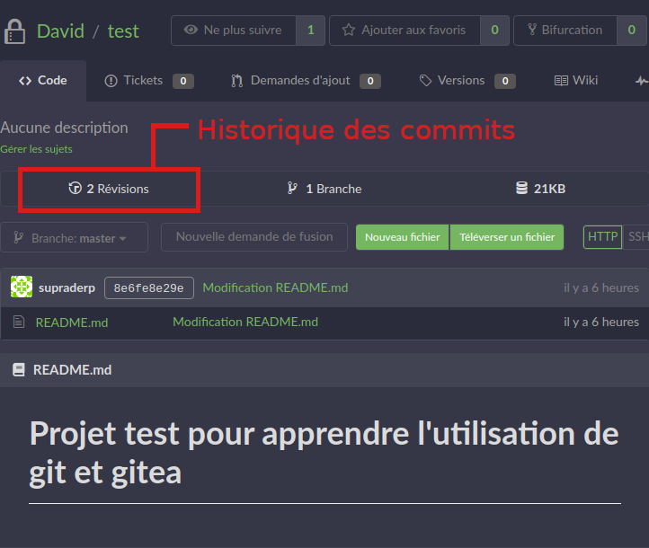

***

### Récupérez des modifications

Nous venons de voir la commande ```git push``` qui permet de "pousser" notre travail en local sur un dépôt en ligne (Gitea en l'ocurrence), mais imaginons que vous modifiez votre repo Gitea en ligne, ou si vous travaillez avec d'autres personnes dessus et qu'elles envoient leurs modifications locales sur le repo en ligne, votre code local ne sera plus à jour.

Pour récupérer en local les dernières modifications du repo Gitea, il vous faut utiliser la commande : 

```sh
# récupère les modifications distantes (remote) que vous ne possédez pas en local
git pull
```

Habituez vous à utiliser git status avant vos ```push```, ```pull```, histoire de bien situer ce que vous souhaiter envoyer ou recevoir :


Ici **Git** m'indique que la branche sur laquelle je me situe et je travail (master) est en retard de 1 commit par rapport à l'origine du master en ligne, j'utilise donc la commande ```git pull``` afin de récupérer en local la/les modification(s).

***

### Créez des branches

Un élément que vous allez être souvent amenés à utiliser lorsque vous travaillez sur un repo, ce sont les **branches**. Les branches permettent de travailler sur des versions de code qui divergent de la branche principale contenant votre code courant. 

À quoi ça sert de créer des variations de la branche principale ?

Travailler sur plusieurs branches est très utile lorsque vous souhaitez tester une expérimentation sur votre projet, ou encore pour vous concentrer sur le développement d'une fonctionnalité spécifique.

Voyons les commandes Git qui vous permettent de manipuler les branche.

- Lorsque vous initialisez un repo Git, votre code est placé dans la branche principale appelée **master** par défaut. 

- Pour voir les branches présentes dans votre repo, utilisez la commande **git branch**. Elle vous retournera les branches présentes, et ajoutera une étoile devant la branche dans laquelle vous êtes placés. Par exemple, dans le 1er repos que vous avez créé dans la partie précédente, la commande git branch n'affichera qu'une seule branche, la branche principale dans laquelle vous vous situez : *** master**. 

- Pour créer une nouvelle branche, il vous suffit d'ajouter le nom de la branche à créer à la suite de la commande précédente :

  ```sh 
  git branch nom_de_branche
  ```

- Pour vous placer dans une autre branche à l'intérieur de votre repo, vous allez avoir besoin d'un nouveau mot-clé : **checkout** : 

  ```sh
  git checkout nom_de_branche
  ```

  Vous pouvez utiliser la commande ```git checkout -b``` pour créer une branche et vous y positionner, au lieu de taper les deux commandes du dessus ```git branch nom_de_branche``` et ```git checkout nom_de_branche``` vous pouvez combiner leur usage en tapant :

  ```sh
  git checkout -b nom_de_branche
  ```

  

  ### Fusionnez des branches

  Lorsque vous travaillez sur plusieurs branches, il va souvent vous arriver de vouloir ajouter  dans une branche A les mises à jour que vous avez faites dans une autre branche B. Pour cela, on se place dans la branche A :

  ```sh
  git checkout brancheA
  ```

  Puis on utilise la commande **git merge** : 

  ```sh
  git merge brancheB
  ```

Nous venons de voir comment fusionner des branches entre elles. Nous avons utilisé un exemple assez simple où tout s'est bien passé. Mais il arrive très souvent qu'il y aie des conflits entre les deux branches qui empêchent de les fusionner, par exemple lorsque plusieurs personnes travaillent en même temps sur un même fichier.

**Exemple :** 

- Votre branche **master** contient un fichier ```hello.md``` avec une ligne de texte : 
  - ```Salut tout le monde 😀```

- Votre branche **develop** (dans mon cas) contient un fichier ```hello.md``` avec une ligne de texte :
  -  Salut tout le monde !

Si vous tentez de fusionner la branche **develop** dans la branche **master** à l'aide des commandes de fusion:

```sh
git checkout master
git merge develop
```

**Git** va reconnaître qu'il existe un conflit entre les deux branches car la 1re ligne du fichier ```hello.md``` est différente dans chacune des branches et afficher le message suivant : 

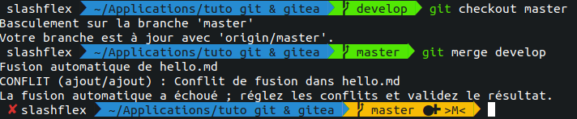

Vous allez donc devoir ouvrir un IDE (Visual Studio Code dans mon cas) pour voir les différences de contenu du fichier ```hello.md``` entre les deux branches :

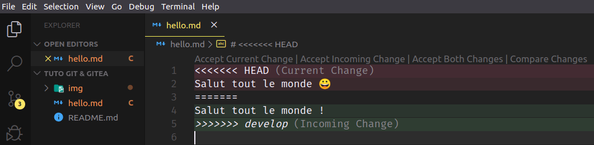

Ici, ```HEAD (Current Change)``` affiche les changements sur la branche en cours (ici **master**) et ```develop (Incomming Change)``` affiche les changements en cours à fusionner sur master. Vous aller pouvoir choisir quel contenu garder pour la branche master dans laquelle vous faites le ```merge```. Par exemple vous pouvez garder ```Salut tout le monde !``` de la branche **develop** en cliquant sur ```Accept Incomming Change``` dans **Visual Studio Code** :

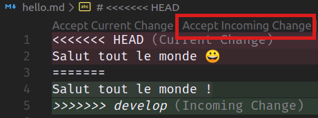

Cette action effacera le contenu du fichier ```hello.md``` de la branche **master** et placera le contenu du fichier ```hello.md``` de la branche **develop** à la place du contenu du fichier de la branche **master**.

Maintenant que vous avez résolu le conflit, il vous reste à le dire à Git ! Car pour l'instant, si vous faites un git status, git vous dira que vous avez des branches non fusionnées ("unmerged paths"). 

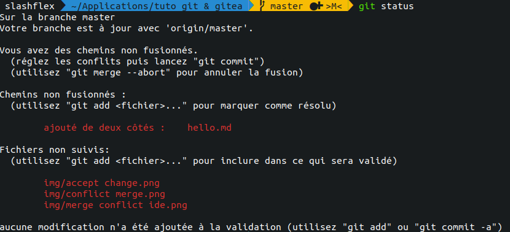

Pour cela, faites un commit sans message : 

```sh 
git add .
git commit
```

Git va détecter que vous avez résolu le conflit et vous proposer un message de commit par défaut :

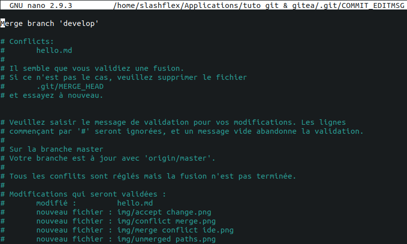

Vous pouvez  alors personnaliser le message du commit si vous le souhaitez. Dans notre cas, la résolution étant assez simple, nous allons garder le message proposé par défaut et le sauvegarder en tapant ```ctrl + x```.

Git va alors vous confirmer que vos branches ont été fusionnées, et si vous consulter l'historique des commits avec ```git log```, vous verrez apparaître le dernier commit de résolution du conflit avec le message :

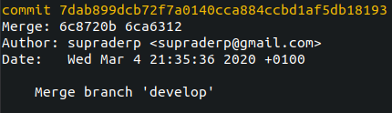

Notre conflit est résolu ! 

***

### Retrouvez qui a fait une modification

Pour retrouver qui a modifié une ligne précise de code dans un projet, faire une recherche avec ```git log``` peut s'avérer compliqué, surtout si le projet contient beaucoup de commits. Il existe un autre moyen plus direct de retrouver qui a fait une modification particulière dans un fichier : 

```sh
git blame nom_du_fichier.extension
# 6ca63127 (David 2020-03-04 20:51:35 +0100 1) Salut tout le monde !
```

Pour retrouver pourquoi cette modification a été faite, vous avez deux possibilités : 

1. Faire un **git log** et rechercher le commit dont le ```SHA``` commence par **6ca63127**. 

2. Utiliser la commande **git show** qui vous renvoie directement les détails du commit recherché en saisissant le début de son ```SHA``` : 

   ```sh
   git show 6ca63127
   ```

   

***

### Ignorer des fichiers

Pour des raisons de sécurité et de clarté, il est important d'ignorer certains fichiers dans Git, tels que :

- Tous les fichiers de configuration (config.xml, databases.yml, .env...)
- Les fichiers et dossiers temporaires (tmp, temp/...)
- Les fichiers inutiles comme ceux créés par votre IDE ou votre OS (.DS_Store, .project...)

Le plus crucial est de ne **JAMAIS versionner une variable de configuration**, que ce soit un mot de passe, une clé secrète ou quoi que ce soit de ce type. Versionner une telle variable conduirait à une large faille de sécurité, surtout si vous mettez votre code en ligne sur Gitea !

Si vous avez ce type de variables de configuration dans votre code, déplacez-les dans un fichier de configuration et ignorez ce fichier dans Git : nous allons voir comment faire cela ci-dessous en utilisant le fichier **.gitignore**.

Par exemple si je crée un fichier de configuration ```.env``` pour un projet, je dois impérativement inclure ce fichier dans le fichier **.gitignore**, car les données contenues dans celui-ci portent sur la connexion à une base de données, avec le mot de passe, l'utilisation d'un web token, l'utilisation d'un client smtp pour l'envoi de mails mais aussi l'utilisation d'un webhook pour stripe, une API de paiment en ligne. (Les données de l'image ci-dessous sont bien entendue factices).

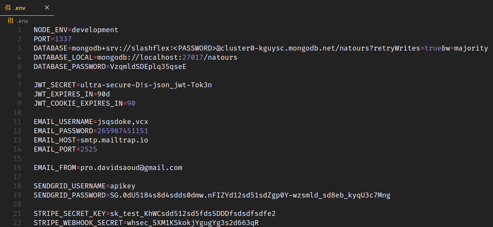

Il est absolument impératif de faire en sorte que **Git** ignore ce type de données **sensibles**.

Créez donc un fichier **.gitignore** à la racine de votre projet :

```sh
cd nom/de/projet
touch .gitignore
```

Ce fichier crée, nous pouvons inclure nos dossiers/fichiers que nous ne souhaitons pas publier sur Gitea

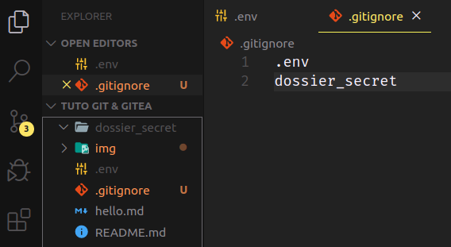

Ici nous avons donc choisi d'ignorer le fichier **```.env```** ainsi que le dossier **```dossier_secret```** en ajoutant leur chemins relatifs dans le fichier **```.gitignore```**, ce fichier et ce dossier ne seront donc pas visible sur Gitea.

Le fichier .gitignore doit être tracké comme vos autres fichiers dans Git : vous devez donc l'ajouter à l'index et le committer. 

```sh
git add .
git commit -m 'ajout fichiers super secrets'
git push
```

***

## Évitez des commits superflus

Imaginez le scénario suivant : vous êtes en train de travailler sur une fonction, lorsque tout à coup une urgence survient et un collègue vous demande de résoudre un bug dans un autre fichier et/ou une autre branche. 

Si vous faites un commit des modifications sur votre fonction à ce stade, cela va alourdir votre historique car vous n'avez pas terminé votre tâche.

Comment faire pour ne pas perdre vos modifications en cours avant de passer à l'urgence à traiter ?

Et bien vous pouvez mettre de côté vos modifications en cours avec la commande :

```sh
git stash
```

Vous pouvez alors vous rendre dans la branche/le fichier que vous devez traiter à l'instant, finir et committer vos modifs. Une fois que vous avez réglé cette urgence, revenez sur la branche sur laquelle vous étiez en train de travailler, et récupérez les modifications que vous aviez mises de côté avec la commande : 

```sh
git stash pop
```

Attention, **pop** vide votre stash des modifications que vous aviez rangées dedans. Donc une fois que vous avez récupéré ces modifications dans votre branche, il vous faut finir votre tâche et les committer ! (ou bien les remettre de côté en exécutant à nouveau la commande git stash).

Si vous voulez garder les modifications dans votre stash, vous pouvez utiliser **apply** à la place de **pop** : 

```sh
git stash apply
```

